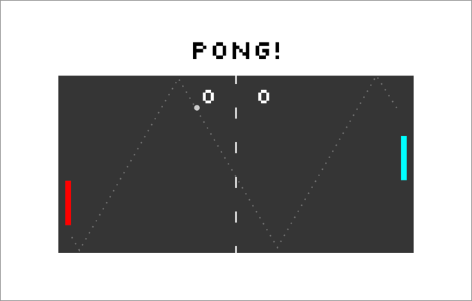

# Pong Game Starter - v0.5.0

A starter project for a basic pong game using SVGs.


&nbsp;

&nbsp;

---

&nbsp;
## Setup

Ensure you have [Node.js](https://nodejs.org/en/) installed first.

**Install dependencies:**

`$ npm install`

**Run locally with the Parcel dev server:**

`$ npm start`

Once you run the start command you can access your project at http://localhost:3000.

Read more about the [Parcel web application bundler here](https://parceljs.org/).
&nbsp;

&nbsp;

---

&nbsp;
## Keys


### - Player 1
- Up : `a`
- Down : `z`

&nbsp;
### - Player 2
- Up : `▲ (Up key)`
- Down : `▼ (Down key)`

&nbsp;
### - Other keys
&nbsp;
    **Special keys during the game play ::**
- *(Last ball only)* Speed up : `f` 
- *(Last ball only)* Speed down : `v` 
- *(Last ball only)* Expand the size : `g`
- *(Last ball only)* Shrink the size : `b`
- Add a ball : `h`
- Subtract a ball : `n`

&nbsp;
**General keys ::**
- Left : `◀︎ (Left key)`
- Right : `▶ (Right key)`
- Select or return : `Enter`
- Pause : `Space`   
&nbsp;

&nbsp;

---

&nbsp;
## Game instructions

### - Step 1 : Select number of players

- Single player 
&nbsp;

    - This play mode is not available.

- Multi-players
&nbsp;

    - 2 players compete each other. 
    - Use `a`, `z` keys for player 1 and `▲`, `▼` keys for player 2.
&nbsp;

&nbsp;
### - Step 2 : Start playing with keyboard

- Player 1 is `Red` and plyaer 2 is `Cyan`.

- The ball will move in 30fps after game begins.
    &nbsp;

    This time can be modified in the file settings.js (`./src/images/setting.js`) and the property(`intervalGameTime: 30`).
- The other player's paddle shrinks by `8` points if ball is hit.
    &nbsp;

    The paddle shrinks until the height is `16` point long.
- Use special keys `f`, `v`, `g`, `b` for more dynamic play.
&nbsp;

&nbsp;
### - Step 3 : Winning

- Either of players scores 10 wins the game.
&nbsp;

    This number can be modified in the file settings.js (`./src/images/setting.js`) and the property(`winningScore: 10`).
&nbsp;

&nbsp;

---

&nbsp;
## Deploy

The deployment workflow for this project will be a bit different from what you've used when deploying simple static websites.

To deploy your finished Pong project as a GitHub page, you must first **update the `predeploy` script in the `package.json` file with the name of your repo.**

For example, if your repo URL is:

https://github.com/bob/pong-project

Update the `predeploy` script as follows:

```json
"predeploy": "rm -rf src && parcel build index.html --public-url /pong-project",
```

Once you have done this, you can run:

`$ npm run deploy`

Now check out your deployed site 🙂
&nbsp;

&nbsp;

---

&nbsp;
## License
- Structural code is open-sourced under the [MIT license](/LICENSE.md). 
&nbsp;

- Learning materials content is copyright (c) 2019 RED Academy.

<3